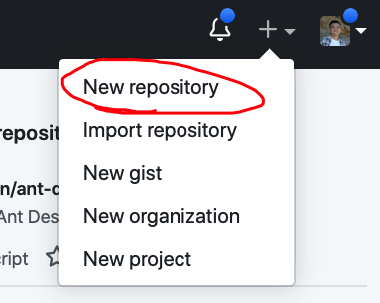
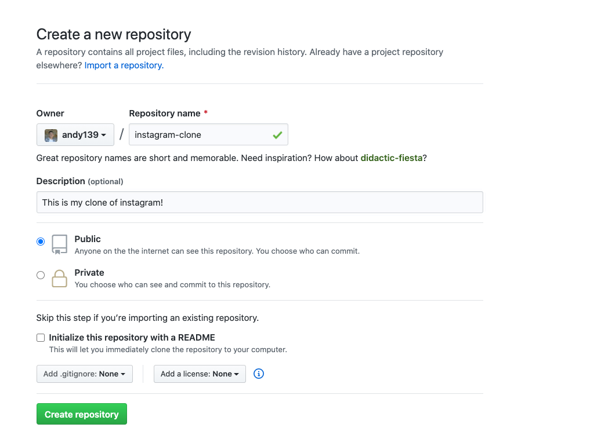
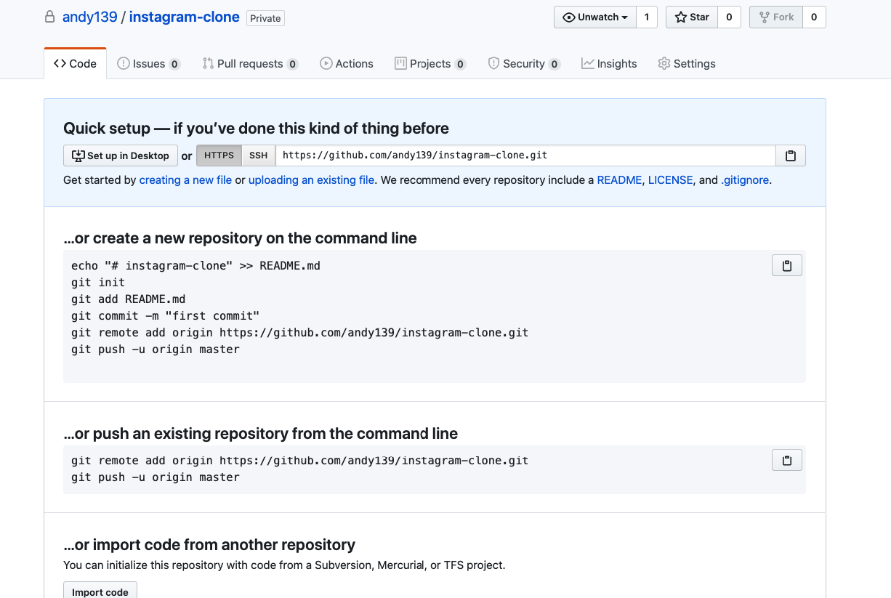

# Git Overview

- Why do we use git?
- Basic commands you need to know.
- A Demo, how to setup your first project on GitHub.


## Why we use git
- Keep track of changes in computer files.
- Multiple people can work on a project at once.


## Git Commands

```
git init
```

- When you first begin your project, use **git init** to setup a git repository. You should do this before you write any code.

```
git status
```
- Use this to see what modified files have not been staged, what files are untracked.

```
git add
```
- Use this to add files to staging. When you git add a file, the next time you commit, this version will be saved in the repo.

```
git commit
```
- This will save the work currently staged (from git add) into the history by creating a new commit. A commit is a checkpoint that you can return to later if your code gets screwed up.

```
git push
```

- This will upload your most recent commits to GitHub


## Setup, how to get your first project up and running!

### 1. Download Git

https://git-scm.com/downloads


### 2. Check if successfully downloaded

Once downloaded, open up terminal press (**CTRL `**) in VSCode. 

```
git --version
```

This should be printed out:
**git version 2.21.0 (Apple Git-122)**

If you have another version, that is completely okay. 

### 3. Configuring Git

Type these commands to set up your Git. Input your email and username like below into terminal. Ideally we would want to use the same email that you used for GitHub, this can be changed later though if you make a mistake.

```
git config --global user.name "Your Name"
git config --global user.email "your@email.com"

```

Nice! We've configured your git to your email and username. Now other users will know whos making changes to files. 


## 4. Creating a GitHub Repo
Okay lets on our now browser and log in to https://github.com. We will create a new repository that our work will be stored on. It should be on the top right hand corner of the navigation bar. Screenshots below:



You will now go to this screen below. Feel free to copy my settings. Create repository.



When you press create repository, stay on that page! We will need it for later. 




## 5. Lets configure your project for GitHub!

In terminal on VSCode let's type these commands. **git init** will create an empty repo in the current directory. Where **git remote add origin https://github.com/your_username/your_repo_name.git** sets the location of the repo. You can copy and paste this line from the page from when we created the repo on GitHub.


```
git init
git remote add origin https://github.com/your_username/your_repo_name.git
```

Congrats! You've successfully added a git repository to your project. 

## 6. Making your first commit to GitHub

Now you've written some code and are ready to commit. Adding and committing will take a snapshot of your code. You need three commands to commit!


```
git add -A
git commit -m "First commit"
git push
```

Line by line

- `git add -A`: adds changes to all files in the working directory to the staging area (Always do this before committing)
- `git commit -m [Your commit message here]`: A commit message is a brief summary of the changes that we're committing. Your commit message should be descriptive and written in the imperative, so that someone reading your commit history (maybe you!) can understand what you changed. Always start your commit messages with with a capital letter, an imperative verb and leave off any trailing punctuation.
  
- `git push`:  pushes our local commits to the remote repository (Changes are now accessible on GitHub server)


## How often to Commit and Push?

Frequently. Pushing to GitHub is good practice! I personally commit to git everytime I make changes to my code. I strongly believe the more commits the better :).


